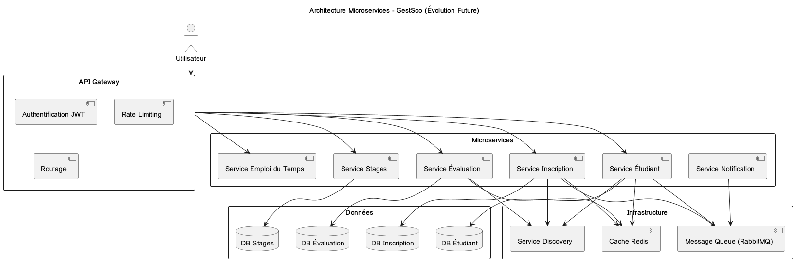
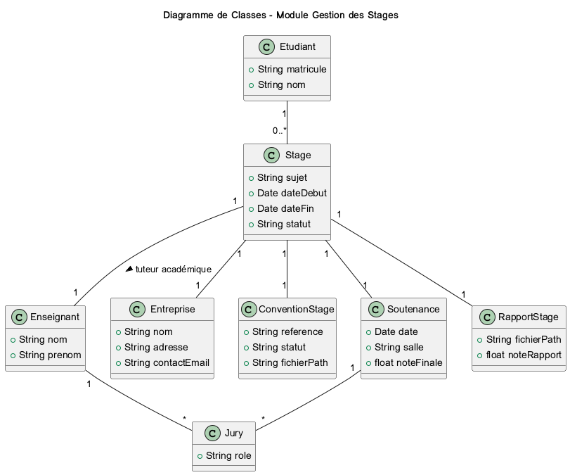
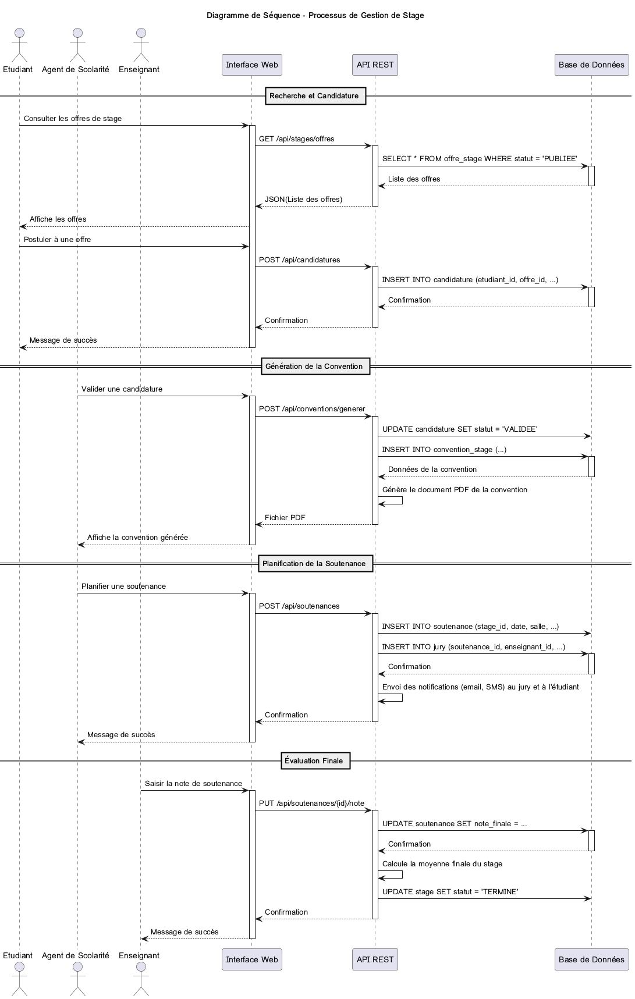

# Améliorations et Optimisations - Progiciel GestSco

**Version** : 2.0
**Date** : 26/12/2025
**Auteur** : Manus AI

---

## Table des matières

1. [Introduction](#1-introduction)
2. [Améliorations Fonctionnelles](#2-améliorations-fonctionnelles)
3. [Optimisations Techniques](#3-optimisations-techniques)
4. [Architecture Avancée](#4-architecture-avancée)
5. [Fonctionnalités Innovantes](#5-fonctionnalités-innovantes)
6. [Roadmap d'Évolution](#6-roadmap-dévolution)

---

## 1. Introduction

Ce document présente un ensemble d'améliorations fonctionnelles et d'optimisations techniques destinées à enrichir le Progiciel de Gestion Intégré **GestSco**. Ces améliorations visent à moderniser le système, améliorer ses performances, et répondre aux besoins émergents des établissements d'enseignement supérieur au Burkina Faso et dans l'espace CAMES.

Les propositions s'articulent autour de quatre axes stratégiques :

1. **Extension des fonctionnalités métier** pour couvrir l'ensemble du cycle de vie de l'étudiant et de l'établissement.
2. **Optimisation des performances** pour garantir une expérience utilisateur fluide même avec des volumes de données importants.
3. **Modernisation de l'architecture** pour assurer l'évolutivité et la maintenabilité du système.
4. **Innovation technologique** pour intégrer les dernières avancées en matière de systèmes d'information universitaires.

---

## 2. Améliorations Fonctionnelles

### 2.1. Module Gestion des Stages et Soutenances

#### 2.1.1. Objectifs

Le module de gestion des stages et soutenances permet d'accompagner les étudiants dans leur parcours académique jusqu'à l'obtention de leur diplôme. Il couvre la gestion complète du processus de stage, depuis la recherche d'un organisme d'accueil jusqu'à la soutenance du rapport de stage ou du mémoire.

#### 2.1.2. Fonctionnalités détaillées

**Gestion du catalogue des offres de stage**

L'établissement et les entreprises partenaires peuvent publier des offres de stage dans un catalogue accessible aux étudiants. Chaque offre comprend une description détaillée du poste, les compétences requises, la durée, le lieu et les modalités de candidature. Les étudiants peuvent consulter ce catalogue, filtrer les offres selon leurs critères (domaine, localisation, durée) et postuler directement via la plateforme.

**Suivi des conventions de stage**

Une fois qu'un étudiant a trouvé un stage, une convention tripartite doit être établie entre l'étudiant, l'établissement et l'organisme d'accueil. Le système permet de générer automatiquement cette convention à partir d'un modèle paramétrable, de la faire signer électroniquement par les trois parties, et de la stocker dans le dossier de l'étudiant. Le système envoie des rappels automatiques aux parties prenantes pour s'assurer que la convention est signée avant le début du stage.

**Gestion des encadreurs et des jurys**

Chaque étudiant en stage se voit attribuer un encadreur académique (enseignant de l'établissement) et un encadreur professionnel (tuteur dans l'organisme d'accueil). Le système permet d'affecter ces encadreurs, de gérer leurs coordonnées et de faciliter la communication entre eux. Pour la soutenance, un jury composé de plusieurs enseignants est constitué. Le système permet de planifier les soutenances en tenant compte des disponibilités des membres du jury et des salles disponibles.

**Planification des soutenances**

Le module intègre un calendrier de planification des soutenances qui prend en compte les contraintes suivantes : disponibilité des salles, disponibilité des membres du jury, nombre de soutenances par jour, durée de chaque soutenance. Un algorithme d'optimisation propose automatiquement un planning qui maximise l'utilisation des ressources tout en respectant les contraintes. Les étudiants et les membres du jury reçoivent des notifications par e-mail et SMS pour leur rappeler la date, l'heure et le lieu de leur soutenance.

**Évaluation et archivage**

Après la soutenance, les membres du jury saisissent leurs notes et leurs appréciations dans le système. La note finale est calculée automatiquement selon une grille d'évaluation paramétrable. Le rapport de stage ou le mémoire est téléchargé dans le système et archivé dans une bibliothèque numérique. Cette bibliothèque permet aux futurs étudiants de consulter les travaux antérieurs pour s'inspirer et aux enseignants de vérifier l'originalité des travaux (détection de plagiat).

#### 2.1.3. Bénéfices attendus

- Simplification du processus de gestion des stages pour les agents de scolarité.
- Amélioration de la traçabilité et de la conformité réglementaire.
- Facilitation de la recherche de stages pour les étudiants.
- Constitution d'une base de connaissances (bibliothèque de rapports et mémoires).
- Réduction du temps de planification des soutenances grâce à l'automatisation.

---

### 2.2. Module Emploi du Temps Intelligent

#### 2.2.1. Objectifs

Le module d'emploi du temps intelligent permet de générer automatiquement des emplois du temps optimisés pour les étudiants, les enseignants et les salles de cours. Il prend en compte de nombreuses contraintes (disponibilités, capacités, équipements) et propose des plannings qui minimisent les conflits et maximisent l'utilisation des ressources.

#### 2.2.2. Fonctionnalités détaillées

**Gestion des ressources**

Le système gère trois types de ressources principales : les enseignants, les salles et les groupes d'étudiants. Pour chaque ressource, le système stocke des informations détaillées :

- **Enseignants** : Nom, prénom, matières enseignées, nombre d'heures de service, disponibilités hebdomadaires, préférences (jours/horaires préférés).
- **Salles** : Nom, capacité, équipements disponibles (vidéoprojecteur, tableau interactif, climatisation), type (amphithéâtre, salle de TP, salle informatique).
- **Groupes** : Nom du groupe, nombre d'étudiants, filière, niveau, semestre.

**Définition des contraintes**

Le système permet de définir deux types de contraintes :

- **Contraintes dures** (obligatoires) : Un enseignant ne peut pas être dans deux salles en même temps, une salle ne peut pas accueillir deux cours en même temps, la capacité de la salle doit être suffisante pour le groupe, l'équipement requis pour le cours doit être disponible dans la salle.
- **Contraintes souples** (préférences) : Éviter les cours le lundi matin ou le vendredi après-midi, regrouper les cours d'une même matière sur la même journée, minimiser les "trous" dans l'emploi du temps des étudiants, respecter les préférences horaires des enseignants.

**Génération automatique des emplois du temps**

Le système utilise un algorithme d'optimisation (algorithme génétique ou recherche locale) pour générer des emplois du temps qui respectent toutes les contraintes dures et maximisent le respect des contraintes souples. L'algorithme explore l'espace des solutions possibles et converge vers une solution optimale ou quasi-optimale. Le processus de génération peut prendre quelques minutes pour un établissement de taille moyenne, mais il permet de gagner des jours de travail manuel.

**Gestion des modifications et des imprévus**

Une fois l'emploi du temps généré, il peut être nécessaire de le modifier en cours de semestre (absence d'un enseignant, indisponibilité d'une salle, etc.). Le système permet de faire des modifications manuelles ponctuelles et de régénérer automatiquement l'emploi du temps pour le reste du semestre en tenant compte de ces modifications. Lorsqu'un cours est déplacé, le système envoie automatiquement des notifications aux étudiants et aux enseignants concernés.

**Consultation et diffusion**

Les emplois du temps sont consultables en ligne par tous les acteurs (étudiants, enseignants, administration). Chaque utilisateur dispose d'une vue personnalisée de son emploi du temps. Les emplois du temps peuvent être exportés dans différents formats (PDF, iCal pour synchronisation avec les agendas électroniques). Des écrans d'affichage dynamique peuvent être installés dans les couloirs de l'établissement pour afficher les emplois du temps en temps réel.

#### 2.2.3. Bénéfices attendus

- Gain de temps considérable pour les responsables de planification.
- Réduction des conflits et des erreurs dans les emplois du temps.
- Meilleure utilisation des ressources (salles, enseignants).
- Amélioration de la satisfaction des étudiants et des enseignants.
- Réactivité accrue face aux imprévus.

---

### 2.3. Module Gestion Financière et Comptabilité de la Scolarité

#### 2.3.1. Objectifs

Le module de gestion financière permet de gérer l'ensemble des flux financiers liés à la scolarité : frais d'inscription, frais de scolarité, bourses, paiements des vacations des enseignants. Il assure la traçabilité des opérations et facilite la production des états financiers.

#### 2.3.2. Fonctionnalités détaillées

**Paramétrage des frais de scolarité**

Les frais de scolarité peuvent varier selon la filière, le niveau, le statut de l'étudiant (boursier, non-boursier, étranger). Le système permet de définir des grilles tarifaires complexes et de les appliquer automatiquement lors de l'inscription de l'étudiant. Des réductions ou des exonérations peuvent être accordées selon des critères définis (mérite, situation sociale, handicap).

**Gestion des échéanciers de paiement**

Les étudiants peuvent payer leurs frais de scolarité en plusieurs fois selon un échéancier défini. Le système génère automatiquement les échéances et envoie des rappels par e-mail et SMS avant chaque date limite. En cas de retard de paiement, des pénalités peuvent être appliquées automatiquement. Le système permet également de gérer les demandes de report d'échéance.

**Encaissement et suivi des paiements**

Les paiements peuvent être effectués par différents moyens : espèces, chèque, virement bancaire, paiement mobile (Orange Money, Moov Money). Le système enregistre chaque paiement, génère un reçu et met à jour le solde de l'étudiant. Un tableau de bord permet de suivre en temps réel l'état des encaissements, d'identifier les impayés et de relancer les étudiants en situation de dette.

**Gestion des bourses**

Pour les étudiants boursiers, le système permet de gérer l'attribution des bourses, le calcul des montants, et le suivi des versements. Les bourses peuvent être déduites automatiquement des frais de scolarité. Le système génère les états nécessaires pour justifier l'utilisation des fonds de bourses auprès des organismes financeurs.

**Gestion des vacations des enseignants**

Le système calcule automatiquement les heures de vacation effectuées par chaque enseignant vacataire en fonction de son emploi du temps. Les taux horaires peuvent varier selon le type de cours (cours magistral, travaux dirigés, travaux pratiques) et le niveau. Le système génère les états de paiement et les fiches de paie. Les enseignants peuvent consulter en ligne le détail de leurs heures et de leurs rémunérations.

**Comptabilité et reporting**

Le module intègre un système de comptabilité simplifié qui enregistre toutes les opérations financières (recettes et dépenses) dans un journal comptable. Des rapports financiers peuvent être générés automatiquement : état des encaissements par période, état des impayés, état des dépenses de vacations, bilan financier de l'année académique. Ces rapports facilitent la prise de décision et la justification des comptes auprès des autorités de tutelle.

#### 2.3.3. Bénéfices attendus

- Amélioration de la gestion de la trésorerie de l'établissement.
- Réduction des impayés grâce aux relances automatiques.
- Transparence et traçabilité des opérations financières.
- Simplification du calcul et du paiement des vacations.
- Gain de temps pour les services financiers et comptables.

---

### 2.4. Module Tableau de Bord et Business Intelligence

#### 2.4.1. Objectifs

Le module de tableau de bord et de Business Intelligence (BI) permet aux décideurs (direction, doyens, chefs de département) de disposer d'une vision synthétique et en temps réel de l'activité de l'établissement. Il facilite le pilotage stratégique et la prise de décision basée sur les données.

#### 2.4.2. Fonctionnalités détaillées

**Indicateurs clés de performance (KPI)**

Le système calcule et affiche automatiquement un ensemble d'indicateurs clés de performance :

- **Effectifs** : Nombre d'étudiants inscrits par filière, par niveau, par genre, évolution des effectifs sur plusieurs années.
- **Résultats académiques** : Taux de réussite par filière, par niveau, par matière, taux de redoublement, taux d'abandon, moyenne générale de la promotion.
- **Assiduité** : Taux de présence aux cours, taux d'absentéisme par filière.
- **Finances** : Montant des encaissements, taux de recouvrement, montant des impayés, dépenses de vacations.
- **Ressources humaines** : Nombre d'enseignants, ratio étudiants/enseignants, charge d'enseignement par enseignant.
- **Infrastructures** : Taux d'occupation des salles, nombre de places disponibles.

**Tableaux de bord personnalisables**

Chaque utilisateur peut créer ses propres tableaux de bord en sélectionnant les indicateurs qui l'intéressent et en choisissant le mode de visualisation (graphique en barres, courbe, camembert, tableau). Les tableaux de bord sont interactifs : l'utilisateur peut cliquer sur un graphique pour obtenir plus de détails ou pour filtrer les données selon différents critères (période, filière, niveau).

**Rapports automatisés**

Le système peut générer automatiquement des rapports périodiques (hebdomadaires, mensuels, trimestriels, annuels) et les envoyer par e-mail aux destinataires concernés. Ces rapports peuvent être au format PDF, Excel ou PowerPoint. Des modèles de rapports prédéfinis sont fournis, mais les utilisateurs peuvent créer leurs propres modèles.

**Analyse prédictive**

En utilisant des techniques de machine learning, le système peut effectuer des analyses prédictives :

- **Prédiction du risque d'échec** : Identification des étudiants à risque d'échec académique en fonction de leurs notes, de leur assiduité et d'autres facteurs. Cela permet de mettre en place des actions de soutien ciblées.
- **Prédiction des effectifs** : Estimation du nombre d'étudiants qui s'inscriront l'année suivante, ce qui facilite la planification des ressources (recrutement d'enseignants, aménagement de salles).
- **Optimisation des ressources** : Identification des salles sous-utilisées, des créneaux horaires peu demandés, ce qui permet d'optimiser l'utilisation des infrastructures.

**Benchmarking**

Pour les universités qui gèrent plusieurs établissements, le système permet de comparer les performances de chaque établissement selon les mêmes indicateurs. Cela favorise l'émulation et l'identification des bonnes pratiques.

#### 2.4.3. Bénéfices attendus

- Prise de décision éclairée basée sur des données objectives.
- Détection précoce des problèmes (baisse des effectifs, augmentation des échecs).
- Amélioration continue de la qualité de l'enseignement.
- Optimisation de l'utilisation des ressources.
- Communication transparente avec les parties prenantes (ministère, bailleurs de fonds).

---

### 2.5. Module Gestion de la Bibliothèque et des Ressources Pédagogiques

#### 2.5.1. Objectifs

Ce module permet de gérer la bibliothèque de l'établissement (livres, revues, thèses) ainsi que les ressources pédagogiques numériques (cours en ligne, vidéos, exercices). Il facilite l'accès aux ressources pour les étudiants et les enseignants.

#### 2.5.2. Fonctionnalités détaillées

**Catalogue de la bibliothèque**

Le système intègre un catalogue complet de tous les ouvrages disponibles dans la bibliothèque. Chaque ouvrage est décrit par ses métadonnées (titre, auteur, éditeur, année, ISBN, mots-clés). Les étudiants et les enseignants peuvent rechercher des ouvrages par titre, auteur, sujet ou mot-clé. Le catalogue indique la disponibilité de chaque ouvrage (disponible, emprunté, réservé) et sa localisation dans la bibliothèque.

**Gestion des prêts et des retours**

Les étudiants et les enseignants peuvent emprunter des ouvrages pour une durée déterminée. Le système enregistre chaque prêt et calcule automatiquement la date de retour. Des rappels sont envoyés par e-mail et SMS avant la date limite de retour. En cas de retard, des pénalités peuvent être appliquées (amende, suspension du droit d'emprunt). Le système permet également de réserver un ouvrage qui est actuellement emprunté.

**Bibliothèque numérique**

En complément de la bibliothèque physique, le système intègre une bibliothèque numérique qui permet de stocker et de diffuser des ressources pédagogiques numériques : cours en PDF, présentations PowerPoint, vidéos de cours, exercices corrigés, sujets d'examens des années précédentes. Les enseignants peuvent télécharger leurs ressources et les rendre accessibles aux étudiants de leurs cours. Les étudiants peuvent consulter ces ressources en ligne ou les télécharger.

**Gestion des droits d'accès**

L'accès aux ressources de la bibliothèque numérique peut être restreint selon le profil de l'utilisateur. Certaines ressources peuvent être accessibles à tous (ressources en libre accès), d'autres uniquement aux étudiants inscrits à un cours spécifique, d'autres encore uniquement aux enseignants. Le système gère finement ces droits d'accès.

**Statistiques d'utilisation**

Le système collecte des statistiques sur l'utilisation de la bibliothèque : nombre d'emprunts par période, ouvrages les plus empruntés, ressources numériques les plus consultées, taux de fréquentation de la bibliothèque. Ces statistiques permettent d'adapter la politique d'acquisition et d'améliorer les services de la bibliothèque.

#### 2.5.3. Bénéfices attendus

- Amélioration de l'accès aux ressources pédagogiques pour les étudiants.
- Réduction de la charge de travail du personnel de la bibliothèque.
- Promotion de l'utilisation des ressources numériques.
- Meilleure gestion du patrimoine documentaire de l'établissement.

---

### 2.6. Module Communication et Notifications Avancées

#### 2.6.1. Objectifs

Ce module permet de faciliter la communication entre tous les acteurs de l'établissement (administration, enseignants, étudiants, parents) et d'assurer la diffusion rapide et ciblée de l'information.

#### 2.6.2. Fonctionnalités détaillées

**Messagerie interne**

Le système intègre une messagerie interne qui permet aux utilisateurs de s'envoyer des messages. Cette messagerie est similaire à un e-mail, mais elle est intégrée au système et permet de conserver l'historique des échanges dans le contexte de l'application. Les enseignants peuvent envoyer des messages à tous les étudiants d'un cours, les agents de scolarité peuvent envoyer des messages ciblés à certains groupes d'étudiants.

**Notifications multi-canaux**

Le système peut envoyer des notifications par différents canaux : notification dans l'application (push notification), e-mail, SMS, notification sur l'application mobile. Les utilisateurs peuvent choisir leurs préférences de notification pour chaque type d'événement (nouvelle note disponible, modification de l'emploi du temps, rappel d'échéance de paiement, etc.).

**Annonces et actualités**

L'administration peut publier des annonces et des actualités sur la page d'accueil du système. Ces annonces peuvent être ciblées par profil (étudiants, enseignants, tous) ou par filière. Les annonces importantes peuvent être épinglées en haut de la page. Les utilisateurs peuvent s'abonner à un flux RSS pour recevoir les actualités de l'établissement.

**Forum de discussion**

Pour chaque cours, un forum de discussion peut être créé. Les étudiants peuvent poser des questions, partager des ressources, discuter entre eux. Les enseignants peuvent modérer le forum et répondre aux questions. Le forum favorise l'apprentissage collaboratif et l'entraide entre étudiants.

**Sondages et enquêtes**

Le système permet de créer facilement des sondages et des enquêtes pour recueillir l'avis des étudiants et des enseignants. Ces enquêtes peuvent porter sur la qualité de l'enseignement, la satisfaction des services, les besoins en formation. Les résultats sont compilés automatiquement et présentés sous forme de graphiques.

#### 2.6.3. Bénéfices attendus

- Amélioration de la communication et de la circulation de l'information.
- Réduction des délais de diffusion de l'information.
- Renforcement du sentiment d'appartenance à la communauté universitaire.
- Recueil systématique du feedback des étudiants et des enseignants.

---

## 3. Optimisations Techniques

### 3.1. Stratégie de Cache Avancée

#### 3.1.1. Objectifs

L'objectif de la mise en cache est de réduire la charge sur la base de données et d'améliorer les temps de réponse de l'application en stockant en mémoire les données fréquemment consultées et rarement modifiées.

#### 3.1.2. Niveaux de cache

Une stratégie de cache à plusieurs niveaux est recommandée :

- **Cache de second niveau (Hibernate)** : Ce cache est géré par l'ORM (Hibernate) et permet de mettre en cache les entités de la base de données. Il est particulièrement efficace pour les entités de référence (telles que `Cycle`, `Niveau`, `Semestre`, `Annee`) qui sont lues très souvent mais modifiées rarement. L'utilisation d'un fournisseur de cache distribué comme **EhCache** ou **Hazelcast** est recommandée pour les déploiements en cluster.

- **Cache de requêtes (Hibernate)** : Ce cache permet de mettre en cache les résultats des requêtes HQL. Il est utile pour les requêtes complexes et coûteuses qui sont exécutées fréquemment avec les mêmes paramètres.

- **Cache applicatif (Spring Cache)** : Ce cache est géré par Spring et permet de mettre en cache les résultats des méthodes des services métier. Il est plus flexible que le cache Hibernate et peut être utilisé pour mettre en cache des DTO (Data Transfer Objects) ou des résultats de calculs complexes.

- **Cache HTTP (Frontend)** : Le frontend peut utiliser des en-têtes de cache HTTP (tels que `ETag` et `Cache-Control`) pour mettre en cache les réponses de l'API REST dans le navigateur de l'utilisateur. Cela réduit le nombre de requêtes envoyées au backend et améliore la réactivité de l'interface utilisateur.

#### 3.1.3. Invalidation du cache

Une stratégie d'invalidation du cache doit être mise en place pour garantir la cohérence des données. Lorsque des données sont modifiées, le cache correspondant doit être invalidé. Spring Cache fournit des annotations (`@CacheEvict`) pour gérer l'invalidation du cache de manière déclarative.

### 3.2. Indexation de la Base de Données

#### 3.2.1. Objectifs

L'indexation de la base de données permet d'accélérer les requêtes de lecture en créant des structures de données qui permettent de retrouver rapidement les enregistrements correspondant à une condition de recherche.

#### 3.2.2. Stratégie d'indexation

- **Clés primaires et étrangères** : Les clés primaires et étrangères sont automatiquement indexées par PostgreSQL, ce qui accélère les jointures entre les tables.

- **Colonnes fréquemment utilisées dans les clauses WHERE** : Les colonnes qui sont souvent utilisées dans les clauses `WHERE` des requêtes `SELECT` doivent être indexées. Par exemple, la colonne `matricule` de la table `etudiant` doit être indexée car elle est souvent utilisée pour rechercher un étudiant.

- **Colonnes utilisées pour le tri** : Les colonnes qui sont souvent utilisées dans les clauses `ORDER BY` doivent être indexées pour accélérer le tri des résultats.

- **Index composites** : Pour les requêtes qui filtrent sur plusieurs colonnes, des index composites (sur plusieurs colonnes) peuvent être créés pour améliorer les performances.

- **Analyse des requêtes lentes** : Il est recommandé d'utiliser l'outil `EXPLAIN ANALYZE` de PostgreSQL pour identifier les requêtes lentes et déterminer les index manquants.

### 3.3. Traitement Asynchrone

#### 3.3.1. Objectifs

Le traitement asynchrone permet d'exécuter des tâches longues (telles que l'envoi d'e-mails, la génération de rapports, l'importation de données) en arrière-plan, sans bloquer l'interface utilisateur. Cela améliore la réactivité de l'application et l'expérience utilisateur.

#### 3.3.2. Mise en œuvre

- **Spring `@Async`** : L'annotation `@Async` de Spring permet d'exécuter une méthode de manière asynchrone dans un thread séparé. C'est une solution simple et efficace pour les tâches asynchrones légères.

- **Files de messages (Message Queues)** : Pour les tâches plus complexes ou pour les systèmes distribués, l'utilisation d'une file de messages (telle que **RabbitMQ** ou **Apache Kafka**) est recommandée. Le backend publie un message dans la file, et un ou plusieurs consommateurs (workers) traitent le message en arrière-plan. Cette architecture est plus robuste et plus évolutive que l'utilisation de `@Async`.

**Exemples de tâches à exécuter de manière asynchrone :**

- Envoi de notifications par e-mail et SMS.
- Génération de rapports PDF ou Excel.
- Importation de fichiers CSV contenant des listes d'étudiants ou de notes.
- Calcul des statistiques pour le tableau de bord.

### 3.4. Optimisation du Code et Refactoring

#### 3.4.1. Objectifs

L'optimisation du code et le refactoring permettent d'améliorer la qualité, la lisibilité, la maintenabilité et les performances du code source.

#### 3.4.2. Bonnes pratiques

- **Revue de code** : Mettre en place un processus de revue de code systématique pour identifier les erreurs, les mauvaises pratiques et les opportunités d'amélioration.

- **Analyse statique du code** : Utiliser des outils d'analyse statique du code (tels que **SonarQube** ou **Checkstyle**) pour détecter automatiquement les bugs, les vulnérabilités et les "code smells".

- **Tests de performance** : Mettre en place des tests de performance (avec des outils comme **JMeter** ou **Gatling**) pour identifier les goulots d'étranglement et les régressions de performance.

- **Refactoring continu** : Appliquer les principes du refactoring pour améliorer la structure du code sans changer son comportement. Par exemple, extraire des méthodes, renommer des variables, simplifier des algorithmes.

- **Utilisation des DTO** : Utiliser des DTO (Data Transfer Objects) pour transférer les données entre le backend et le frontend. Cela permet de ne transférer que les données nécessaires et d'éviter les problèmes de performance liés au chargement paresseux (lazy loading) des entités JPA.

### 3.5. Optimisation des Performances Frontend

#### 3.5.1. Objectifs

L'optimisation des performances frontend vise à réduire le temps de chargement de l'application et à améliorer sa réactivité.

#### 3.5.2. Techniques d'optimisation

- **Lazy Loading des modules Angular** : Charger les modules Angular à la demande (lazy loading) pour réduire la taille du bundle initial et accélérer le premier chargement de l'application.

- **Tree Shaking** : Utiliser le tree shaking pour éliminer le code mort (non utilisé) du bundle final.

- **Minification et compression** : Minifier les fichiers JavaScript et CSS et les compresser avec Gzip ou Brotli pour réduire leur taille.

- **Optimisation des images** : Compresser les images et utiliser des formats modernes (comme WebP) pour réduire leur poids.

- **Pagination et défilement infini** : Pour les listes longues (étudiants, notes, etc.), utiliser la pagination ou le défilement infini pour ne charger que les données visibles à l'écran.

- **Change Detection Strategy OnPush** : Utiliser la stratégie de détection de changement `OnPush` dans les composants Angular pour réduire le nombre de vérifications de changement et améliorer les performances.

---

## 4. Architecture Avancée

### 4.1. Évolution vers une Architecture Microservices

#### 4.1.1. Contexte

L'architecture actuelle de GestSco est une architecture monolithique 3-tiers. Cette architecture est adaptée pour un déploiement initial et pour des établissements de taille petite à moyenne. Cependant, pour des établissements de grande taille ou pour des universités qui gèrent plusieurs établissements, une évolution vers une architecture microservices peut être envisagée.

#### 4.1.2. Avantages des microservices

Une architecture microservices présente plusieurs avantages :

- **Scalabilité indépendante** : Chaque microservice peut être déployé et mis à l'échelle indépendamment des autres. Par exemple, si le service d'évaluation est très sollicité pendant la période des examens, il peut être répliqué sur plusieurs instances sans affecter les autres services.

- **Développement parallèle** : Différentes équipes peuvent travailler sur différents microservices en parallèle, ce qui accélère le développement de nouvelles fonctionnalités.

- **Résilience** : Si un microservice tombe en panne, les autres microservices continuent de fonctionner. Le système est donc plus résilient.

- **Choix technologique** : Chaque microservice peut être développé avec la technologie la plus adaptée à ses besoins. Par exemple, un microservice de génération de rapports peut être développé en Python, tandis que les autres microservices sont en Java.

#### 4.1.3. Proposition d'architecture

Le diagramme suivant illustre une proposition d'architecture microservices pour GestSco.

Les principaux microservices identifiés sont :

- **Service Étudiant** : Gestion des dossiers étudiants (informations personnelles, historique académique).
- **Service Inscription** : Gestion des inscriptions administratives et pédagogiques.
- **Service Évaluation** : Gestion des notes, des coefficients, des calculs de moyennes et des résultats.
- **Service Stages** : Gestion des stages, des conventions, des soutenances.
- **Service Emploi du Temps** : Génération et gestion des emplois du temps.
- **Service Notification** : Envoi de notifications par e-mail, SMS et push.
- **Service Reporting** : Génération de rapports et de statistiques.

#### 4.1.4. Technologies recommandées

Pour mettre en œuvre une architecture microservices, les technologies suivantes sont recommandées :

- **Spring Cloud** : Ensemble de bibliothèques pour développer des microservices avec Spring Boot (Service Discovery avec Eureka, API Gateway avec Spring Cloud Gateway, Configuration centralisée avec Spring Cloud Config).
- **Docker** : Conteneurisation des microservices pour faciliter le déploiement.
- **Kubernetes** : Orchestration des conteneurs pour gérer le déploiement, la mise à l'échelle et la haute disponibilité des microservices.
- **RabbitMQ ou Apache Kafka** : Communication asynchrone entre les microservices via des files de messages.
- **Redis** : Cache distribué partagé entre les microservices.

### 4.2. Architecture de Haute Disponibilité

#### 4.2.1. Objectifs

Pour les établissements qui ont des exigences élevées en termes de disponibilité, une architecture de haute disponibilité (HA) doit être mise en place. L'objectif est de garantir que le système reste accessible même en cas de panne d'un composant.

#### 4.2.2. Composants de l'architecture HA

- **Réplication de la base de données** : Mise en place d'une réplication maître-esclave (ou maître-maître) de PostgreSQL pour garantir la disponibilité des données en cas de panne du serveur de base de données principal.

- **Load Balancer** : Utilisation d'un répartiteur de charge (tel que **HAProxy** ou **Nginx**) pour distribuer les requêtes entre plusieurs instances du backend. Si une instance tombe en panne, le load balancer redirige automatiquement les requêtes vers les instances restantes.

- **Clustering du backend** : Déploiement de plusieurs instances du backend Spring Boot en cluster. Les sessions utilisateur sont partagées entre les instances via un cache distribué (Redis ou Hazelcast).

- **Monitoring et alerting** : Mise en place d'un système de monitoring (tel que **Prometheus** et **Grafana**) pour surveiller l'état de santé des différents composants du système. Des alertes sont envoyées automatiquement en cas de problème.

- **Plan de reprise d'activité (PRA)** : Définition d'un plan de reprise d'activité qui décrit les procédures à suivre en cas de sinistre majeur (incendie, inondation, etc.). Ce plan inclut la restauration des sauvegardes sur un site de secours.

---

## 5. Fonctionnalités Innovantes

### 5.1. Application Mobile Native

#### 5.1.1. Objectifs

Le développement d'une application mobile native (iOS et Android) permet d'offrir une expérience utilisateur optimisée pour les smartphones et les tablettes. L'application mobile permet aux étudiants et aux enseignants d'accéder aux fonctionnalités essentielles de GestSco en mobilité.

#### 5.1.2. Fonctionnalités de l'application mobile

- **Consultation du dossier étudiant** : Les étudiants peuvent consulter leurs informations personnelles, leur historique académique, leurs notes et leurs résultats.
- **Consultation de l'emploi du temps** : Les étudiants et les enseignants peuvent consulter leur emploi du temps en temps réel et recevoir des notifications en cas de modification.
- **Notifications push** : Les utilisateurs reçoivent des notifications push pour les événements importants (nouvelle note disponible, modification de l'emploi du temps, rappel d'échéance de paiement).
- **Paiement mobile** : Les étudiants peuvent payer leurs frais de scolarité directement depuis l'application via les services de paiement mobile (Orange Money, Moov Money).
- **Accès à la bibliothèque numérique** : Les étudiants peuvent consulter et télécharger les ressources pédagogiques numériques.
- **Mode hors ligne** : Certaines fonctionnalités (consultation de l'emploi du temps, consultation des notes) sont disponibles en mode hors ligne.

#### 5.1.3. Technologies recommandées

- **Flutter** : Framework de développement d'applications mobiles multiplateformes (iOS et Android) développé par Google. Il permet de développer une seule base de code pour les deux plateformes.
- **React Native** : Framework de développement d'applications mobiles multiplateformes développé par Facebook. Il utilise JavaScript et React.

### 5.2. Intelligence Artificielle et Machine Learning

#### 5.2.1. Prédiction du risque d'échec

Un modèle de machine learning peut être entraîné pour prédire le risque d'échec d'un étudiant en fonction de différents facteurs : notes obtenues aux évaluations précédentes, taux d'assiduité, résultats du baccalauréat, situation socio-économique. Le système peut ainsi identifier les étudiants à risque et proposer des actions de soutien ciblées (tutorat, cours de rattrapage, accompagnement psychologique).

#### 5.2.2. Recommandation de parcours

Un système de recommandation peut suggérer aux étudiants des parcours de formation adaptés à leur profil, à leurs intérêts et à leurs résultats académiques. Par exemple, un étudiant qui a de bons résultats en mathématiques et en physique pourrait se voir recommander une orientation vers une filière d'ingénierie.

#### 5.2.3. Détection de plagiat

Un système de détection de plagiat basé sur l'intelligence artificielle peut être intégré pour vérifier l'originalité des rapports de stage et des mémoires. Le système compare le document soumis avec une base de données de documents existants et calcule un score de similarité.

#### 5.2.4. Chatbot d'assistance

Un chatbot intelligent peut être mis en place pour répondre automatiquement aux questions fréquentes des étudiants et des enseignants. Le chatbot utilise le traitement du langage naturel (NLP) pour comprendre les questions et fournir des réponses pertinentes. Il peut être intégré dans l'application web et dans l'application mobile.

### 5.3. Blockchain pour la Certification des Diplômes

#### 5.3.1. Objectifs

L'utilisation de la blockchain pour la certification des diplômes permet de garantir l'authenticité et l'inviolabilité des diplômes délivrés par l'établissement. Chaque diplôme est enregistré dans une blockchain publique ou privée, ce qui permet à n'importe qui de vérifier son authenticité.

#### 5.3.2. Fonctionnement

Lorsqu'un étudiant obtient son diplôme, un enregistrement est créé dans la blockchain. Cet enregistrement contient les informations suivantes : nom de l'étudiant, intitulé du diplôme, date d'obtention, nom de l'établissement, hash du document PDF du diplôme. Un QR code est imprimé sur le diplôme papier. En scannant ce QR code, n'importe qui peut vérifier l'authenticité du diplôme en consultant la blockchain.

#### 5.3.3. Avantages

- **Lutte contre la fraude** : Il devient impossible de falsifier un diplôme car toute modification serait détectable dans la blockchain.
- **Vérification instantanée** : Les employeurs et les autres établissements peuvent vérifier instantanément l'authenticité d'un diplôme sans avoir à contacter l'établissement émetteur.
- **Portabilité internationale** : Les diplômes enregistrés dans une blockchain peuvent être reconnus à l'international.

### 5.4. Intégration avec les Systèmes Nationaux et Régionaux

#### 5.4.1. Intégration avec le Système National d'Information Universitaire

Au Burkina Faso et dans d'autres pays de l'espace CAMES, des systèmes nationaux d'information universitaire sont en cours de développement. GestSco doit pouvoir s'interfacer avec ces systèmes pour échanger des données (effectifs, résultats, diplômes). Des API REST standardisées doivent être mises en place pour faciliter cette intégration.

#### 5.4.2. Intégration avec le Système CAMES

Le CAMES développe des outils et des référentiels pour harmoniser l'enseignement supérieur dans l'espace francophone africain. GestSco doit être conforme à ces référentiels et doit pouvoir échanger des données avec les systèmes du CAMES (par exemple, pour la reconnaissance des diplômes).

#### 5.4.3. Intégration avec les systèmes de paiement mobile

L'intégration avec les principaux opérateurs de paiement mobile (Orange Money, Moov Money, MTN Mobile Money) permet aux étudiants de payer leurs frais de scolarité directement depuis leur téléphone mobile. Cette intégration se fait via des API fournies par les opérateurs.

---

## 6. Roadmap d'Évolution

### 6.1. Phase 1 : Stabilisation et Optimisation (6 mois)

**Objectifs** : Stabiliser la version actuelle de GestSco, corriger les bugs, optimiser les performances.

**Livrables** :
- Correction de tous les bugs critiques et majeurs.
- Mise en place de la stratégie de cache.
- Indexation de la base de données.
- Optimisation du code frontend et backend.
- Documentation technique complète.
- Formation des utilisateurs.

### 6.2. Phase 2 : Extension Fonctionnelle (12 mois)

**Objectifs** : Ajouter les modules fonctionnels avancés.

**Livrables** :
- Module de gestion des stages et soutenances.
- Module d'emploi du temps intelligent.
- Module de gestion financière et comptabilité.
- Module de tableau de bord et Business Intelligence.
- Module de gestion de la bibliothèque.
- Module de communication et notifications avancées.

### 6.3. Phase 3 : Innovation et Modernisation (18 mois)

**Objectifs** : Intégrer des fonctionnalités innovantes et moderniser l'architecture.

**Livrables** :
- Application mobile native (iOS et Android).
- Intégration de l'intelligence artificielle (prédiction du risque d'échec, recommandation de parcours, chatbot).
- Certification des diplômes par blockchain.
- Évolution vers une architecture microservices (optionnel).
- Architecture de haute disponibilité.
- Intégration avec les systèmes nationaux et régionaux.

### 6.4. Phase 4 : Déploiement à Grande Échelle et Support (continu)

**Objectifs** : Déployer GestSco dans de nombreux établissements, assurer le support et la maintenance.

**Livrables** :
- Déploiement dans au moins 10 établissements.
- Support technique continu.
- Maintenance corrective et évolutive.
- Mise à jour régulière de la documentation.
- Formation continue des utilisateurs.

---

## 7. Conclusion

Les améliorations et optimisations proposées dans ce document visent à transformer GestSco en un système d'information universitaire de classe mondiale, capable de répondre aux besoins des établissements d'enseignement supérieur les plus exigeants. L'adoption d'une approche progressive, avec une roadmap claire, permettra de déployer ces améliorations de manière maîtrisée et de maximiser le retour sur investissement.

L'intégration de technologies modernes (microservices, intelligence artificielle, blockchain, application mobile) positionnera GestSco comme un leader dans le domaine des systèmes d'information universitaires en Afrique francophone et dans l'espace CAMES.

---

## Annexes

### Annexe A : Diagramme de Classes - Module Gestion des Stages

### Annexe B : Diagramme de Séquence - Processus de Gestion de Stage

### Annexe C : Architecture Microservices

---

**Fin du document**
