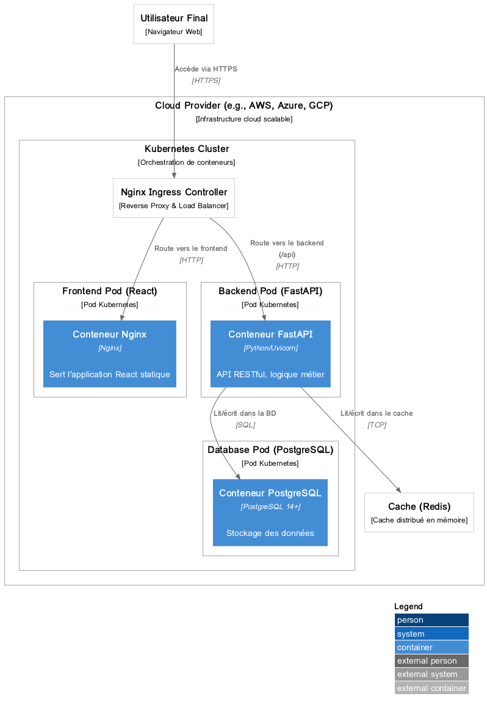
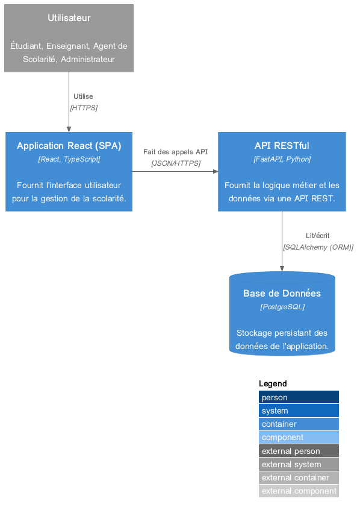

# Dossier de Conception Technique - Progiciel GestSco

**Version** : 3.0 - Migration React/FastAPI
**Date** : 26/12/2025
**Auteur** : Manus AI

---

## Table des matières

1. [Introduction](#1-introduction)
   1.1. [Objectif du document](#11-objectif-du-document)
   1.2. [Périmètre du projet](#12-périmètre-du-projet)
   1.3. [Définitions, Acronymes et Abréviations](#13-définitions-acronymes-et-abréviations)
2. [Références](#2-références)
3. [Conception Architecturale](#3-conception-architecturale)
   3.1. [Vue d'ensemble de l'architecture](#31-vue-densemble-de-larchitecture)
   3.2. [Pile Technologique](#32-pile-technologique)
   3.3. [Vue de déploiement](#33-vue-de-déploiement)
   3.4. [Vue des composants](#34-vue-des-composants)
4. [Spécifications Fonctionnelles](#4-spécifications-fonctionnelles)
   4.1. [Acteurs du système](#41-acteurs-du-système)
   4.2. [Diagramme des cas d'utilisation](#42-diagramme-des-cas-dutilisation)
   4.3. [Description des modules fonctionnels](#43-description-des-modules-fonctionnels)
5. [Conception des Données](#5-conception-des-données)
   5.1. [Diagramme de classes (Modèle Logique)](#51-diagramme-de-classes-modèle-logique)
   5.2. [Dictionnaire des données](#52-dictionnaire-des-données)
6. [Conception Détaillée](#6-conception-détaillée)
   6.1. [Diagramme de séquence : Saisie des notes](#61-diagramme-de-séquence--saisie-des-notes)

---

## 1. Introduction

### 1.1. Objectif du document

Ce document a pour objectif de fournir une description technique complète pour la conception et le développement du Progiciel de Gestion Intégré (PGI) **GestSco**. Il s'adresse aux équipes de développement, de test et de maintenance, ainsi qu'aux chefs de projet.

Le progiciel vise à moderniser la gestion de la scolarité des établissements d'enseignement supérieur au Burkina Faso, en s'assurant de sa conformité avec le référentiel du **Conseil Africain et Malgache pour l'Enseignement Supérieur (CAMES)**, notamment dans le cadre du système Licence-Master-Doctorat (LMD).

### 1.2. Périmètre du projet

Le périmètre du projet couvre l'ensemble des fonctionnalités nécessaires à la gestion du cursus de l'étudiant, depuis son inscription administrative jusqu'à l'obtention de son diplôme. Cela inclut :

- La gestion de l'offre de formation (filières, modules, matières).
- La gestion des inscriptions administratives et pédagogiques.
- La gestion des évaluations (notes, coefficients).
- Le calcul des résultats, la gestion des délibérations et des rattrapages.
- La gestion du dossier de l'étudiant.
- La production de documents administratifs (attestations, relevés de notes, diplômes).
- La gestion des utilisateurs et des habilitations.

### 1.3. Définitions, Acronymes et Abréviations

| Acronyme | Signification |
|---|---|
| **PGI** | Progiciel de Gestion Intégré |
| **CAMES** | Conseil Africain et Malgache pour l'Enseignement Supérieur |
| **LMD** | Licence-Master-Doctorat |
| **SI** | Système d'Information |
| **UML** | Unified Modeling Language |
| **API** | Application Programming Interface |
| **REST** | REpresentational State Transfer |
| **UI** | User Interface (Interface Utilisateur) |
| **JDBC** | Java Database Connectivity |

---

## 2. Références

Ce document s'appuie sur les sources suivantes :

1.  Référentiel pour le cadre de développement des systèmes d’information dans les institutions d’enseignement supérieur et de recherche (CAMES, 2014)
2.  Guide de formation du LMD à l’usage des Institutions d’Enseignement Supérieur d’Afrique Francophone (CAMES)
3.  Cadre de cohérence - Gestion de la scolarité dans le supérieur (CPU, 2005)
4.  Présentation du Progiciel de Gestion intégré de la Scolarité - GestSco v1.0 (YanSoft, 2013)
5.  Code source de l'application existante (Frontend Angular et Backend Spring Boot).
6.  Export de la base de données PostgreSQL de l'application existante.


## 3. Conception Architecturale

### 3.1. Vue d'ensemble de l'architecture

L'application GestSco est conçue sur une architecture 3-tiers (Three-Tier) moderne, découplée et orientée services. Cette architecture favorise la maintenabilité, l'évolutivité et la séparation des préoccupations.

Les trois couches sont les suivantes :

1.  **Couche de Présentation (Client)** : Une application web monopage (Single Page Application - SPA) développée avec la bibliothèque **React**. Elle est responsable de l'interface utilisateur et de l'expérience utilisateur (UI/UX). Elle communique avec la couche métier via des appels à une API REST.

2.  **Couche Métier (Serveur d'Application)** : Une application backend développée avec le framework **FastAPI** en Python. Elle expose une API REST asynchrone et haute performance qui implémente toute la logique métier de l'application. Elle gère les transactions, la sécurité et la communication avec la base de données.

3.  **Couche de Données (Serveur de Base de Données)** : Une base de données relationnelle **PostgreSQL** qui assure la persistance des données de l'application. L'accès aux données est géré par la couche métier via l'ORM **SQLAlchemy**.

### 3.2. Pile Technologique

| Couche | Technologie | Version | Description |
|---|---|---|---|
| **Frontend** | React | ^18.2.0 | Bibliothèque JavaScript pour la construction d'interfaces utilisateur. |
| | Material-UI (MUI) | ^5.10.0 | Framework de composants React pour un design moderne. |
| | TypeScript | ^5.0.0 | Sur-ensemble de JavaScript qui ajoute le typage statique. |
| | React Router | ^6.4.0 | Pour la gestion de la navigation (routing). |
| | Axios | ^1.1.0 | Client HTTP pour les appels API. |
| | Zustand | ^4.1.0 | Gestionnaire d'état simple et performant. |
| **Backend** | Python | 3.11+ | Langage de programmation principal. |
| | FastAPI | ^0.104.0 | Framework web haute performance pour la création d'API. |
| | SQLAlchemy | ^2.0.0 | Framework ORM pour la persistance des données. |
| | Pydantic | ^2.0.0 | Bibliothèque de validation de données. |
| | Alembic | ^1.9.0 | Outil de gestion des migrations de base de données. |
| **Base de Données** | PostgreSQL | 14+ | Système de gestion de base de données relationnelle-objet. |
| **Construction** | Poetry / pip | | Outils de gestion de dépendances et de construction de projets Python. |
| **Serveur Web** | Nginx | | Pour servir les fichiers statiques React et comme reverse proxy. |
| **Serveur d'App.**| Uvicorn | | Serveur ASGI pour l'application FastAPI. |

### 3.3. Vue de déploiement

Le diagramme ci-dessous illustre l'architecture physique cible pour le déploiement de GestSco.



### 3.4. Vue des composants

Ce diagramme montre les principaux composants logiciels et leurs interdépendances au sein de l'architecture.



---

## 4. Spécifications Fonctionnelles

### 4.1. Acteurs du système

Les principaux acteurs interagissant avec le système GestSco sont :

| Acteur | Description |
|---|---|
| **Agent de Scolarité** | Personnel administratif responsable de la gestion quotidienne des dossiers étudiants, des inscriptions, des évaluations et de l'organisation pédagogique. |
| **Enseignant** | Personnel académique responsable de la saisie des notes, de la consultation des listes d'étudiants et de son emploi du temps. |
| **Étudiant** | Apprenant inscrit dans l'établissement, qui consulte ses informations personnelles, ses notes, ses résultats et son emploi du temps. |
| **Administrateur** | Super-utilisateur responsable de la configuration globale du système, de la gestion des utilisateurs et des droits d'accès, et de la maintenance technique. |

### 4.2. Diagramme des cas d'utilisation

Le diagramme suivant présente les principales interactions entre les acteurs et le système.


### 4.3. Description des modules fonctionnels

Le progiciel s'articule autour de plusieurs modules fonctionnels majeurs, conformes aux besoins décrits dans la documentation de référence [4].

#### 4.3.1. Module Organisation Pédagogique
Ce module est le socle de l'application. Il permet de structurer l'offre de formation de l'établissement en conformité avec le système LMD.
- Gestion des entités structurelles : Universités, Établissements, Départements.
- Gestion de l'offre de formation : Filières, Cycles (Licence, Master, Doctorat), Niveaux (L1, L2, M1...), Semestres.
- Gestion du catalogue des enseignements : Modules, Matières (Unités d'Enseignement - UE).
- Association des matières aux modules et des modules aux offres de formation.

#### 4.3.2. Module Inscription
Ce module gère l'intégralité du processus d'inscription des étudiants.
- **Inscription Administrative** : Saisie et mise à jour des informations personnelles de l'étudiant, gestion du dossier administratif.
- **Inscription Pédagogique** : Inscription de l'étudiant aux enseignements (matières/UE) pour une année académique donnée, en fonction de son cursus, de ses acquis et de ses dettes éventuelles.
- **Gestion des Groupes** : Création de groupes/classes et affectation des étudiants.

#### 4.3.3. Module Évaluation et Notation
Ce module est dédié à la gestion des résultats académiques.
- Paramétrage des modalités d'évaluation : définition des types de notes (Contrôle Continu, Examen, Rattrapage) et de leurs coefficients.
- Saisie sécurisée des notes par les enseignants.
- Calcul automatique des moyennes par matière, module, semestre et année.
- Gestion des délibérations, des crédits ECTS acquis, et des redoublements.
- Génération des documents : relevés de notes, attestations de réussite, diplômes.

#### 4.3.4. Module Administration et Sécurité
Ce module transverse assure la bonne gestion et la sécurité de la plateforme.
- Gestion des utilisateurs (création, modification, suppression).
- Gestion fine des rôles et des permissions (habilitations) par profil.
- Traçabilité des actions via des journaux d'événements (logs).
- Paramétrage global de l'application (année académique en cours, etc.).

### 4.4. Améliorations Fonctionnelles Proposées

En plus des modules de base, les améliorations fonctionnelles suivantes sont proposées pour enrichir le progiciel GestSco et en faire une solution de gestion universitaire complète et moderne.

#### 4.4.1. Module Gestion des Stages et Soutenances

**Objectifs**

Le module de gestion des stages et soutenances permet d'accompagner les étudiants dans leur parcours académique jusqu'à l'obtention de leur diplôme. Il couvre la gestion complète du processus de stage, depuis la recherche d'un organisme d'accueil jusqu'à la soutenance du rapport de stage ou du mémoire.

**Fonctionnalités détaillées**

- **Gestion du catalogue des offres de stage** : Publication d'offres de stage par l'établissement et les entreprises partenaires, consultation et candidature par les étudiants.
- **Suivi des conventions de stage** : Génération automatique de conventions tripartites, signature électronique, stockage dans le dossier de l'étudiant.
- **Gestion des encadreurs et des jurys** : Affectation des encadreurs académiques et professionnels, constitution des jurys de soutenance.
- **Planification des soutenances** : Calendrier de planification optimisé en fonction des disponibilités des salles et des membres du jury.
- **Évaluation et archivage** : Saisie des notes de soutenance, calcul de la note finale, archivage des rapports de stage et mémoires dans une bibliothèque numérique.

**Diagramme de Classes - Module Gestion des Stages**


**Diagramme de Séquence - Processus de Gestion de Stage**


#### 4.4.2. Module Emploi du Temps Intelligent

**Objectifs**

Le module d'emploi du temps intelligent permet de générer automatiquement des emplois du temps optimisés pour les étudiants, les enseignants et les salles de cours, en tenant compte de multiples contraintes.

**Fonctionnalités détaillées**

- **Gestion des ressources** : Gestion détaillée des enseignants, des salles (avec leurs équipements) et des groupes d'étudiants.
- **Définition des contraintes** : Définition de contraintes dures (obligatoires) et souples (préférences).
- **Génération automatique des emplois du temps** : Utilisation d'un algorithme d'optimisation pour générer des plannings optimaux.
- **Gestion des modifications et des imprévus** : Modification manuelle et régénération automatique de l'emploi du temps, avec notifications automatiques.
- **Consultation et diffusion** : Consultation en ligne des emplois du temps personnalisés, exportation aux formats PDF et iCal.

#### 4.4.3. Module Gestion Financière et Comptabilité de la Scolarité

**Objectifs**

Le module de gestion financière permet de gérer l'ensemble des flux financiers liés à la scolarité : frais d'inscription, frais de scolarité, bourses, paiements des vacations des enseignants.

**Fonctionnalités détaillées**

- **Paramétrage des frais de scolarité** : Définition de grilles tarifaires complexes.
- **Gestion des échéanciers de paiement** : Génération automatique des échéances et envoi de rappels.
- **Encaissement et suivi des paiements** : Gestion des paiements multi-canaux (espèces, chèque, virement, paiement mobile).
- **Gestion des bourses** : Attribution, calcul et suivi des versements.
- **Gestion des vacations des enseignants** : Calcul automatique des heures de vacation et génération des états de paiement.
- **Comptabilité et reporting** : Journal comptable, rapports financiers automatisés.

#### 4.4.4. Module Tableau de Bord et Business Intelligence

**Objectifs**

Le module de tableau de bord et de Business Intelligence (BI) permet aux décideurs de disposer d'une vision synthétique et en temps réel de l'activité de l'établissement.

**Fonctionnalités détaillées**

- **Indicateurs clés de performance (KPI)** : Calcul et affichage d'indicateurs sur les effectifs, les résultats académiques, les finances, les ressources humaines, etc.
- **Tableaux de bord personnalisables** : Création de tableaux de bord interactifs et personnalisés.
- **Rapports automatisés** : Génération et envoi de rapports périodiques.
- **Analyse prédictive** : Prédiction du risque d'échec, prédiction des effectifs, optimisation des ressources.

#### 4.4.5. Module Gestion de la Bibliothèque et des Ressources Pédagogiques

**Objectifs**

Ce module permet de gérer la bibliothèque de l'établissement (livres, revues, thèses) ainsi que les ressources pédagogiques numériques (cours en ligne, vidéos, exercices).

**Fonctionnalités détaillées**

- **Catalogue de la bibliothèque** : Recherche et consultation des ouvrages disponibles.
- **Gestion des prêts et des retours** : Enregistrement des prêts, calcul des dates de retour, envoi de rappels.
- **Bibliothèque numérique** : Stockage et diffusion de ressources pédagogiques numériques.
- **Gestion des droits d'accès** : Accès restreint aux ressources selon le profil de l'utilisateur.
- **Statistiques d'utilisation** : Collecte de statistiques sur l'utilisation de la bibliothèque.

#### 4.4.6. Module Communication et Notifications Avancées

**Objectifs**

Ce module permet de faciliter la communication entre tous les acteurs de l'établissement et d'assurer la diffusion rapide et ciblée de l'information.

**Fonctionnalités détaillées**

- **Messagerie interne** : Messagerie intégrée pour les échanges entre utilisateurs.
- **Notifications multi-canaux** : Notifications par push, e-mail, SMS.
- **Annonces et actualités** : Publication d'annonces sur la page d'accueil.
- **Forum de discussion** : Forum de discussion pour chaque cours.
- **Sondages et enquêtes** : Création de sondages pour recueillir l'avis des utilisateurs.

---

## 5. Conception des Données

### 5.1. Diagramme de classes (Modèle Logique)

Le diagramme de classes ci-dessous représente les principales entités métier du système et leurs relations. Il est dérivé de l'analyse de la base de données existante et des entités du domaine JHipster.


### 5.2. Dictionnaire des données

Le dictionnaire des données détaille la structure de chaque table de la base de données. Le rapport complet est généré à partir de l'analyse du schéma SQL.

> **Note** : Un rapport détaillé de la structure de la base de données est disponible dans le fichier `rapport_structure_db.md`.

Voici la liste des principales entités métier identifiées :

| N° | Entité | Description |
|----|---|---|
| 1 | annee | Année académique |
| 2 | coeficient | Coefficient d'une matière pour un type de note donné |
| 3 | coordinateur | Coordinateur de filière ou de cycle |
| 4 | cycle | Cycle d'étude (Licence, Master, Doctorat) |
| 5 | departement | Département ou UFR de l'établissement |
| 6 | enseignement | Offre de formation pour une année, un niveau et une filière |
| 7 | etablissement | Établissement d'enseignement supérieur |
| 8 | etudiant | Dossier de l'étudiant |
| 9 | filiere | Filière de formation |
| 10 | importation | Données importées (ex: listes d'étudiants) |
| 11 | inscrit | Inscription d'un étudiant à une formation |
| 12 | matiere | Matière ou Unité d'Enseignement (UE) |
| 13 | mention | Mention du diplôme |
| 14 | module | Module regroupant plusieurs matières |
| 15 | moyenne | Moyenne calculée pour un étudiant |
| 16 | niveau | Niveau d'étude (L1, L2, M1...) |
| 17 | note | Note obtenue par un étudiant dans une évaluation |
| 18 | parametre | Paramètres généraux de l'application |
| 19 | profil | Profil utilisateur (rôles) |
| 20 | resultat | Résultat final d'un étudiant (admis, refusé, etc.) |
| 21 | semestre | Semestre d'étude (S1, S2...) |
| 22 | type_note | Type de note (CC, Examen, Rattrapage) |
| 23 | universite | Université de tutelle |

---

## 6. Conception Détaillée

Cette section illustre le comportement dynamique du système à travers des diagrammes de séquence pour des scénarios d'utilisation clés.

### 6.1. Diagramme de séquence : Saisie des notes

Ce diagramme décrit le processus de saisie des notes par un enseignant, depuis la sélection de l'évaluation jusqu'à la sauvegarde des notes dans la base de données.


**Description du flux :**

1.  L'**Enseignant** se connecte à l'application et navigue vers l'interface de saisie des notes. Il sélectionne une évaluation spécifique (par exemple, l'examen de "Droit Constitutionnel" pour le Semestre 1 de la L1 Droit).
2.  L'**Interface Web (Frontend)** envoie une requête à l'API REST pour récupérer la liste des étudiants inscrits à cette évaluation.
3.  Le **Backend** reçoit la requête, vérifie les droits de l'enseignant, puis interroge la base de données pour obtenir la liste des étudiants concernés.
4.  La **Base de Données** retourne la liste des étudiants.
5.  Le **Backend** formate les données en JSON et les renvoie au Frontend.
6.  Le **Frontend** affiche un formulaire de saisie avec la liste des étudiants et des champs pour entrer les notes.
7.  L'**Enseignant** saisit les notes dans le formulaire et soumet.
8.  Le **Frontend** envoie les notes saisies (généralement dans un tableau d'objets JSON) au Backend via une requête POST.
9.  Le **Backend** valide les données reçues (par exemple, s'assure que les notes sont dans l'intervalle [0, 20]) et enregistre chaque note dans la base de données.
10. Une fois toutes les notes enregistrées, le **Backend** renvoie une réponse de succès au Frontend.
11. Le **Frontend** affiche un message de confirmation à l'enseignant.

---

## 7. Spécifications Techniques Détaillées

### 7.1. Architecture Backend (Spring Boot)

L'architecture backend suit les principes de conception de **Spring Boot** et **JHipster**, qui préconisent une organisation en couches bien définies.

#### 7.1.1. Organisation des packages

```
com.scolarite.gestsco
├── config/              # Configuration de l'application (sécurité, base de données, etc.)
├── domain/              # Entités JPA (modèle de domaine)
│   └── enumeration/     # Énumérations métier
├── repository/          # Interfaces de repositories (accès aux données)
├── service/             # Services métier (logique applicative)
│   └── dto/             # Data Transfer Objects
├── web.rest/            # Contrôleurs REST (API)
└── security/            # Configuration de la sécurité (JWT, OAuth2, etc.)
```

#### 7.1.2. Entités du domaine

Les entités du domaine sont annotées avec JPA (Java Persistence API) et Hibernate pour la persistance. Chaque entité hérite de la classe abstraite `AbstractAuditingEntity` qui fournit les champs d'audit :

- `createdBy` : Nom de l'utilisateur ayant créé l'enregistrement.
- `createdDate` : Date de création de l'enregistrement.
- `lastModifiedBy` : Nom de l'utilisateur ayant modifié l'enregistrement en dernier.
- `lastModifiedDate` : Date de la dernière modification.

**Exemples d'entités principales :**

- `Universite` : Représente une université.
- `Etablissement` : Représente un établissement d'enseignement supérieur.
- `Departement` : Représente un département ou une UFR.
- `Filiere` : Représente une filière de formation.
- `Cycle` : Représente un cycle d'étude (Licence, Master, Doctorat).
- `Niveau` : Représente un niveau d'étude (L1, L2, M1, etc.).
- `Semestre` : Représente un semestre (S1, S2, etc.).
- `Annee` : Représente une année académique.
- `Module` : Représente un module d'enseignement.
- `Matiere` : Représente une matière ou une Unité d'Enseignement (UE).
- `Enseignement` : Représente une offre de formation pour une année, un niveau et une filière donnés.
- `Etudiant` : Représente un étudiant.
- `Inscrit` : Représente l'inscription d'un étudiant à une formation.
- `Note` : Représente une note obtenue par un étudiant.
- `Coeficient` : Représente le coefficient d'une matière pour un type de note.
- `TypeNote` : Représente un type de note (CC, Examen, Rattrapage).
- `Moyenne` : Représente une moyenne calculée.
- `Resultat` : Représente le résultat final d'un étudiant.
- `User` : Représente un utilisateur du système.
- `Authority` : Représente un rôle ou une autorité.
- `Profil` : Représente un profil utilisateur.

#### 7.1.3. API REST

L'API REST est exposée via des contrôleurs situés dans le package `web.rest`. Chaque contrôleur gère les opérations CRUD (Create, Read, Update, Delete) pour une entité donnée.

**Exemple de routes API :**

| Méthode HTTP | Route | Description |
|---|---|---|
| GET | `/api/etudiants` | Récupérer la liste de tous les étudiants |
| GET | `/api/etudiants/{id}` | Récupérer un étudiant par son ID |
| POST | `/api/etudiants` | Créer un nouvel étudiant |
| PUT | `/api/etudiants/{id}` | Mettre à jour un étudiant existant |
| DELETE | `/api/etudiants/{id}` | Supprimer un étudiant |

### 7.2. Architecture Frontend (Angular)

L'application frontend est une Single Page Application (SPA) développée avec **Angular 12**. Elle suit l'architecture standard d'Angular, organisée en modules, composants et services.

#### 7.2.1. Organisation des dossiers

```
src/
├── app/
│   ├── core/               # Services et fonctionnalités partagés (authentification, etc.)
│   ├── shared/             # Composants, directives et pipes partagés
│   ├── layouts/            # Layouts de l'application (header, footer, sidebar)
│   ├── entities/           # Modules pour chaque entité (étudiant, filière, etc.)
│   │   ├── etudiant/
│   │   │   ├── etudiant.component.ts
│   │   │   ├── etudiant.service.ts
│   │   │   └── etudiant.model.ts
│   │   └── ...
│   └── admin/              # Module d'administration
├── assets/                 # Ressources statiques (images, CSS, etc.)
└── environments/           # Configuration des environnements (dev, prod)
```

#### 7.2.2. Communication avec le Backend

Les services Angular utilisent le module `HttpClient` pour communiquer avec l'API REST du backend. Les requêtes sont effectuées en JSON et les réponses sont désérialisées en objets TypeScript.

**Exemple de service Angular :**

```typescript
import { Injectable } from '@angular/core';
import { HttpClient } from '@angular/common/http';
import { Observable } from 'rxjs';
import { Etudiant } from './etudiant.model';

@Injectable({ providedIn: 'root' })
export class EtudiantService {
  private apiUrl = '/api/etudiants';

  constructor(private http: HttpClient) {}

  getAll(): Observable<Etudiant[]> {
    return this.http.get<Etudiant[]>(this.apiUrl);
  }

  getById(id: number): Observable<Etudiant> {
    return this.http.get<Etudiant>(`${this.apiUrl}/${id}`);
  }

  create(etudiant: Etudiant): Observable<Etudiant> {
    return this.http.post<Etudiant>(this.apiUrl, etudiant);
  }

  update(id: number, etudiant: Etudiant): Observable<Etudiant> {
    return this.http.put<Etudiant>(`${this.apiUrl}/${id}`, etudiant);
  }

  delete(id: number): Observable<void> {
    return this.http.delete<void>(`${this.apiUrl}/${id}`);
  }
}
```

### 7.3. Sécurité

La sécurité de l'application repose sur plusieurs mécanismes :

1.  **Authentification** : L'authentification des utilisateurs est gérée par Spring Security. Le système utilise des tokens JWT (JSON Web Tokens) pour sécuriser les sessions.
2.  **Autorisation** : Les droits d'accès sont gérés via des rôles et des permissions. Chaque utilisateur se voit attribuer un ou plusieurs rôles (ex : ROLE_ADMIN, ROLE_SCOLARITE, ROLE_ENSEIGNANT, ROLE_ETUDIANT). Les endpoints de l'API sont protégés par des annotations Spring Security qui vérifient les rôles requis.
3.  **Cryptage des mots de passe** : Les mots de passe des utilisateurs sont cryptés avec l'algorithme BCrypt avant d'être stockés dans la base de données.
4.  **Protection CSRF** : La protection contre les attaques CSRF (Cross-Site Request Forgery) est activée.
5.  **HTTPS** : En production, l'application doit être déployée derrière un serveur web configuré pour utiliser HTTPS (TLS/SSL).

### 7.4. Gestion des migrations de base de données

Les migrations de base de données sont gérées par **Liquibase**. Chaque modification du schéma de la base de données est décrite dans un fichier de changelog XML ou YAML. Liquibase s'assure que les migrations sont appliquées de manière ordonnée et traçable.

**Exemple de changelog Liquibase :**

```xml
<changeSet id="20250101-1" author="admin">
    <createTable tableName="etudiant">
        <column name="id" type="bigint" autoIncrement="true">
            <constraints primaryKey="true" nullable="false"/>
        </column>
        <column name="matricule" type="varchar(50)">
            <constraints nullable="false" unique="true"/>
        </column>
        <column name="nom" type="varchar(100)">
            <constraints nullable="false"/>
        </column>
        <column name="prenom" type="varchar(100)">
            <constraints nullable="false"/>
        </column>
        <column name="date_naissance" type="date"/>
    </createTable>
</changeSet>
```

---

## 8. Conformité au Référentiel CAMES

Le système GestSco a été conçu pour être conforme aux exigences du **Conseil Africain et Malgache pour l'Enseignement Supérieur (CAMES)**, notamment en ce qui concerne le système **Licence-Master-Doctorat (LMD)**.

### 8.1. Respect de l'architecture LMD

Le système LMD structure l'enseignement supérieur en trois cycles :

- **Licence** : Premier cycle d'une durée de 3 ans (L1, L2, L3), sanctionné par un diplôme de Licence.
- **Master** : Deuxième cycle d'une durée de 2 ans (M1, M2), sanctionné par un diplôme de Master.
- **Doctorat** : Troisième cycle d'une durée variable (généralement 3 à 5 ans), sanctionné par un diplôme de Doctorat.

Le progiciel GestSco permet de gérer ces trois cycles de manière distincte et cohérente. La table `Cycle` de la base de données permet de définir chaque cycle, et la table `Niveau` permet de définir les niveaux d'étude au sein de chaque cycle.

### 8.2. Gestion des crédits ECTS

Le système LMD utilise le système de crédits **ECTS** (European Credit Transfer and Accumulation System). Un crédit ECTS représente environ 25 à 30 heures de travail étudiant. Une année académique correspond généralement à 60 crédits ECTS.

GestSco intègre la gestion des crédits ECTS :

- Chaque matière (UE) se voit attribuer un nombre de crédits.
- Les crédits sont acquis lorsque l'étudiant valide la matière (note supérieure ou égale à 10/20, par exemple).
- Le système calcule automatiquement le nombre de crédits acquis par l'étudiant à chaque semestre et sur l'ensemble de son cursus.

### 8.3. Organisation semestrielle

Le système LMD organise l'année académique en deux semestres. Chaque semestre comprend un ensemble d'Unités d'Enseignement (UE) que l'étudiant doit valider.

GestSco gère cette organisation semestrielle :

- La table `Semestre` permet de définir les semestres (S1, S2, S3, S4, S5, S6 pour la Licence, par exemple).
- Les enseignements sont associés à un semestre spécifique.
- Les évaluations et les résultats sont calculés par semestre.

### 8.4. Capitalisation des acquis

Le système LMD permet la capitalisation des acquis : une fois qu'une UE est validée, elle est définitivement acquise, même en cas de redoublement. GestSco assure cette capitalisation en conservant l'historique des résultats de l'étudiant et en ne lui demandant de repasser que les UE non validées.

### 8.5. Mobilité et transfert

Le système LMD favorise la mobilité des étudiants entre établissements et pays. GestSco facilite cette mobilité en produisant des relevés de notes et des attestations conformes aux standards internationaux, permettant la reconnaissance des acquis dans d'autres établissements.

---

## 9. Exigences Non Fonctionnelles

### 9.1. Performance

- **Temps de réponse** : Les pages de l'application doivent se charger en moins de 2 secondes dans des conditions normales d'utilisation.
- **Charge** : Le système doit pouvoir gérer simultanément au moins 500 utilisateurs connectés sans dégradation significative des performances.
- **Volumétrie** : Le système doit pouvoir gérer des bases de données contenant jusqu'à 100 000 étudiants et 1 000 000 d'enregistrements de notes.

### 9.2. Disponibilité

- **Taux de disponibilité** : Le système doit avoir un taux de disponibilité de 99% (hors maintenance planifiée).
- **Maintenance** : Les opérations de maintenance doivent être planifiées en dehors des heures de pointe (généralement la nuit ou le week-end).

### 9.3. Sécurité

- **Authentification forte** : Tous les utilisateurs doivent s'authentifier avec un nom d'utilisateur et un mot de passe robuste.
- **Cryptage** : Les mots de passe doivent être cryptés dans la base de données.
- **Traçabilité** : Toutes les actions sensibles (création, modification, suppression de données) doivent être tracées dans des journaux d'événements.
- **Sauvegardes** : Des sauvegardes automatiques de la base de données doivent être effectuées quotidiennement.

### 9.4. Ergonomie et Accessibilité

- **Interface intuitive** : L'interface utilisateur doit être simple, intuitive et facile à utiliser, même pour des utilisateurs non techniques.
- **Responsive Design** : L'application doit être accessible depuis différents types d'appareils (ordinateurs de bureau, tablettes, smartphones).
- **Accessibilité** : L'application doit respecter les normes d'accessibilité pour les personnes en situation de handicap (WCAG 2.0 niveau AA).

### 9.5. Maintenabilité

- **Code source** : Le code source doit être bien structuré, commenté et respecter les bonnes pratiques de développement.
- **Documentation** : Une documentation technique complète doit être fournie (architecture, API, base de données).
- **Tests** : Des tests unitaires et d'intégration doivent être mis en place pour garantir la qualité du code.

### 9.6. Évolutivité

- **Modularité** : L'architecture du système doit permettre l'ajout de nouveaux modules fonctionnels sans refonte majeure.
- **Scalabilité** : Le système doit pouvoir évoluer pour supporter une augmentation du nombre d'utilisateurs et de données.

---

## 10. Plan de Déploiement

### 10.1. Prérequis matériels et logiciels

Pour déployer le progiciel GestSco, les prérequis suivants doivent être respectés :

**Serveur Backend et Base de Données :**

| Composant | Spécification Minimale | Spécification Recommandée |
|---|---|---|
| Processeur | 2 cœurs (2 GHz) | 4 cœurs (2.5 GHz) |
| Mémoire RAM | 4 Go | 8 Go ou plus |
| Espace disque | 50 Go | 100 Go ou plus (SSD recommandé) |
| Système d'exploitation | Ubuntu 20.04 LTS ou Windows Server 2016 | Ubuntu 22.04 LTS ou Windows Server 2022 |
| Java | JDK 17 | JDK 17 ou supérieur |
| Base de données | PostgreSQL 12 | PostgreSQL 14 ou supérieur |

**Serveur Web (Frontend) :**

| Composant | Spécification |
|---|---|
| Serveur Web | Apache 2.4 ou Nginx 1.18 |
| Système d'exploitation | Ubuntu 20.04 LTS ou Windows Server 2016 |

**Réseau :**

Un réseau local (LAN) Ethernet TCP/IP performant est requis pour assurer une communication fluide entre les postes clients et les serveurs.

### 10.2. Étapes de déploiement

Le déploiement du progiciel GestSco comprend les étapes suivantes :

1.  **Préparation de l'infrastructure** : Installation et configuration des serveurs (serveur d'application, serveur de base de données, serveur web).
2.  **Installation de la base de données** : Installation de PostgreSQL, création de la base de données et du schéma initial via les scripts Liquibase.
3.  **Déploiement du backend** : Copie du fichier JAR du backend sur le serveur d'application, configuration du fichier `application.yml` (connexion à la base de données, paramètres de sécurité), et démarrage de l'application Spring Boot.
4.  **Déploiement du frontend** : Compilation de l'application Angular en mode production (`ng build --prod`), copie des fichiers statiques générés sur le serveur web, et configuration du serveur web pour servir l'application.
5.  **Configuration du pare-feu** : Ouverture des ports nécessaires (80 pour HTTP, 443 pour HTTPS, 8080 pour l'API backend si nécessaire).
6.  **Tests de déploiement** : Vérification du bon fonctionnement de l'application (connexion, navigation, fonctionnalités critiques).
7.  **Formation des utilisateurs** : Formation du personnel de l'établissement à l'utilisation du progiciel.
8.  **Mise en production** : Basculement vers l'environnement de production et communication aux utilisateurs.

### 10.3. Stratégie de sauvegarde

Une stratégie de sauvegarde robuste est essentielle pour garantir la pérennité des données. La stratégie recommandée est la suivante :

- **Sauvegarde quotidienne** : Sauvegarde complète de la base de données chaque nuit (par exemple, à 2h du matin).
- **Sauvegarde incrémentielle** : Sauvegarde des modifications toutes les 6 heures.
- **Rétention** : Conservation des sauvegardes quotidiennes pendant 30 jours, et des sauvegardes mensuelles pendant 1 an.
- **Stockage externe** : Copie des sauvegardes sur un support externe (disque dur externe, serveur distant, cloud) pour se prémunir contre les sinistres (incendie, vol, etc.).
- **Tests de restauration** : Tests réguliers de restauration des sauvegardes pour s'assurer de leur intégrité.

---

## 11. Maintenance et Support

### 11.1. Maintenance corrective

La maintenance corrective consiste à corriger les bugs et les dysfonctionnements identifiés après la mise en production. Un système de suivi des incidents (ticketing) doit être mis en place pour permettre aux utilisateurs de signaler les problèmes rencontrés.

### 11.2. Maintenance évolutive

La maintenance évolutive consiste à faire évoluer le progiciel pour répondre à de nouveaux besoins ou pour intégrer de nouvelles fonctionnalités. Les demandes d'évolution doivent être évaluées, planifiées et développées selon un processus de gestion de projet structuré.

### 11.3. Support technique

Un support technique doit être assuré pour accompagner les utilisateurs dans l'utilisation quotidienne du progiciel. Ce support peut prendre plusieurs formes :

- **Support téléphonique** : Ligne téléphonique dédiée pour répondre aux questions urgentes.
- **Support par e-mail** : Adresse e-mail pour les demandes d'assistance moins urgentes.
- **Documentation en ligne** : Manuel utilisateur, FAQ, tutoriels vidéo.
- **Formation continue** : Sessions de formation régulières pour les nouveaux utilisateurs ou pour présenter les nouvelles fonctionnalités.

---

## 12. Conclusion

Le progiciel **GestSco** représente une solution complète et moderne pour la gestion de la scolarité dans les établissements d'enseignement supérieur au Burkina Faso. Conçu en conformité avec le référentiel du CAMES et le système LMD, il offre une plateforme robuste, évolutive et sécurisée pour gérer l'ensemble du parcours de l'étudiant, de son inscription à l'obtention de son diplôme.

L'architecture 3-tiers adoptée, basée sur des technologies éprouvées (Angular, Spring Boot, PostgreSQL), garantit la pérennité et la maintenabilité du système. Les diagrammes UML fournis dans ce document offrent une vision claire de la structure et du comportement du système, facilitant ainsi la compréhension et la communication entre les différentes parties prenantes du projet.

Ce dossier de conception technique constitue un guide de référence pour les équipes de développement, de test et de maintenance. Il doit être mis à jour régulièrement pour refléter les évolutions du système et garantir la cohérence entre la documentation et l'implémentation réelle.

---

## Annexes

### Annexe A : Rapport détaillé de la structure de la base de données

Un rapport détaillé de la structure de la base de données est disponible dans le fichier `rapport_structure_db.md`. Ce rapport liste l'ensemble des tables, leurs colonnes, leurs types de données et leurs relations.

### Annexe B : Liste des entités métier

La liste complète des entités métier identifiées dans le système est disponible dans le fichier `liste_entites.txt`.

### Annexe C : Structure JSON de la base de données

Une représentation JSON de la structure de la base de données est disponible dans le fichier `db_structure.json`. Ce fichier peut être utilisé pour des traitements automatisés ou pour générer d'autres types de documentation.

### Annexe D : Fichiers sources des diagrammes UML

Les fichiers sources PlantUML des diagrammes sont fournis :

- `diagramme_cas_utilisation.puml`
- `diagramme_classes.puml`
- `diagramme_composants.puml`
- `diagramme_deploiement.puml`
- `diagramme_sequence_saisie_note.puml`

Ces fichiers peuvent être modifiés et régénérés selon les besoins.

---

**Fin du document**


---

## 8. Optimisations Techniques et Architecture Avancée

Cette section présente des recommandations pour l'optimisation des performances, l'amélioration de la maintenabilité et l'évolution de l'architecture de GestSco.

### 8.1. Optimisations Techniques

#### 8.1.1. Stratégie de Cache Avancée

- **Objectifs** : Réduire la charge sur la base de données et améliorer les temps de réponse.
- **Niveaux de cache** : Mise en place d'un cache de second niveau (Hibernate avec EhCache/Hazelcast), d'un cache de requêtes, d'un cache applicatif (Spring Cache) et d'un cache HTTP côté frontend.
- **Invalidation** : Stratégie d'invalidation claire avec `@CacheEvict` pour garantir la cohérence des données.

#### 8.1.2. Indexation de la Base de Données

- **Objectifs** : Accélérer les requêtes de lecture.
- **Stratégie** : Indexation des clés primaires/étrangères, des colonnes utilisées dans les clauses `WHERE` et `ORDER BY`, et utilisation d'index composites. Analyse régulière des requêtes lentes avec `EXPLAIN ANALYZE`.

#### 8.1.3. Traitement Asynchrone

- **Objectifs** : Exécuter les tâches longues en arrière-plan pour ne pas bloquer l'interface utilisateur.
- **Mise en œuvre** : Utilisation de `@Async` de Spring pour les tâches simples et de files de messages (RabbitMQ/Kafka) pour les traitements plus complexes (envoi de notifications, génération de rapports, etc.).

#### 8.1.4. Optimisation du Code et Refactoring

- **Objectifs** : Améliorer la qualité, la lisibilité et la maintenabilité du code.
- **Bonnes pratiques** : Revues de code, analyse statique (SonarQube), tests de performance (JMeter/Gatling), refactoring continu et utilisation systématique des DTOs.

#### 8.1.5. Optimisation des Performances Frontend

- **Objectifs** : Réduire le temps de chargement et améliorer la réactivité de l'interface.
- **Techniques** : Lazy loading des modules Angular, tree shaking, minification/compression, optimisation des images, pagination/défilement infini, et stratégie de détection de changement `OnPush`.

### 8.2. Architecture Avancée

#### 8.2.1. Évolution vers une Architecture Microservices

- **Contexte** : Pour les déploiements à grande échelle, une évolution de l'architecture monolithique vers une architecture microservices est recommandée pour améliorer la scalabilité, la résilience et la flexibilité.
- **Proposition d'architecture** :

  

- **Technologies recommandées** : Spring Cloud, Docker, Kubernetes, RabbitMQ/Kafka, Redis.

#### 8.2.2. Architecture de Haute Disponibilité (HA)

- **Objectifs** : Garantir la continuité de service.
- **Composants** : Réplication de la base de données, load balancer, clustering du backend, monitoring et alerting (Prometheus/Grafana), et un Plan de Reprise d'Activité (PRA).

---

## 9. Fonctionnalités Innovantes

### 9.1. Application Mobile Native

- **Objectifs** : Offrir une expérience utilisateur optimisée sur smartphones et tablettes.
- **Fonctionnalités** : Consultation du dossier, emploi du temps, notifications push, paiement mobile, accès aux ressources hors ligne.
- **Technologies** : Flutter ou React Native.

### 9.2. Intelligence Artificielle et Machine Learning

- **Prédiction du risque d'échec** : Identifier les étudiants en difficulté pour un soutien proactif.
- **Recommandation de parcours** : Suggérer des orientations personnalisées.
- **Détection de plagiat** : Vérifier l'originalité des travaux.
- **Chatbot d'assistance** : Répondre aux questions fréquentes des utilisateurs.

### 9.3. Blockchain pour la Certification des Diplômes

- **Objectifs** : Garantir l'authenticité et l'inviolabilité des diplômes.
- **Fonctionnement** : Enregistrement d'un hash du diplôme sur une blockchain, vérifiable via un QR code.
- **Avantages** : Lutte contre la fraude, vérification instantanée, portabilité internationale.

### 9.4. Intégration avec les Systèmes Nationaux et Régionaux

- **Interopérabilité** : Assurer la compatibilité et l'échange de données avec les systèmes d'information nationaux et ceux du CAMES via des API standardisées.

---

## 10. Roadmap d'Évolution

| Phase | Durée | Objectifs | Livrables Clés |
|---|---|---|---|
| **1** | 6 mois | Stabilisation & Optimisation | Correction des bugs, mise en place du cache et de l'indexation, optimisation du code. |
| **2** | 12 mois | Extension Fonctionnelle | Développement des modules : Stages, Emploi du Temps, Finances, BI, Bibliothèque, Communication. |
| **3** | 18 mois | Innovation & Modernisation | Application mobile, intégration de l'IA, certification blockchain, évolution vers les microservices. |
| **4** | Continu | Déploiement & Support | Déploiement à grande échelle, support technique, maintenance corrective et évolutive. |

